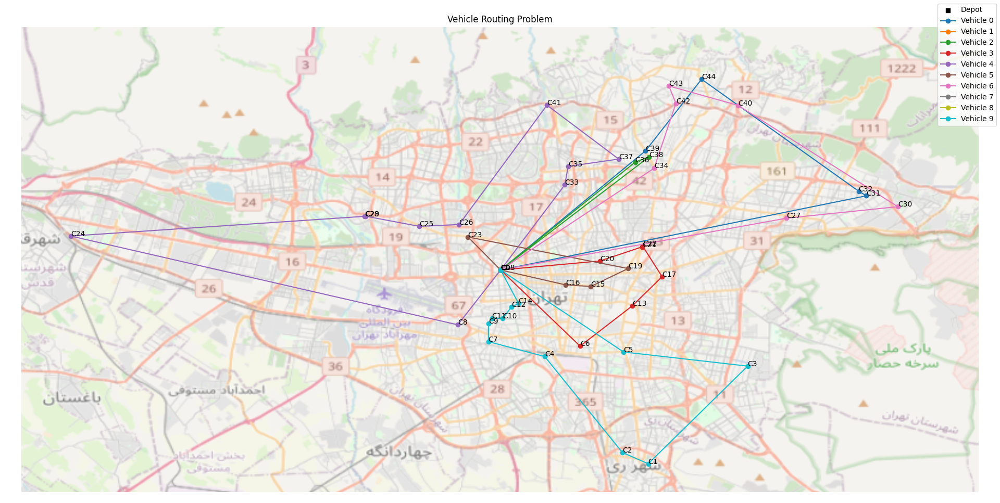
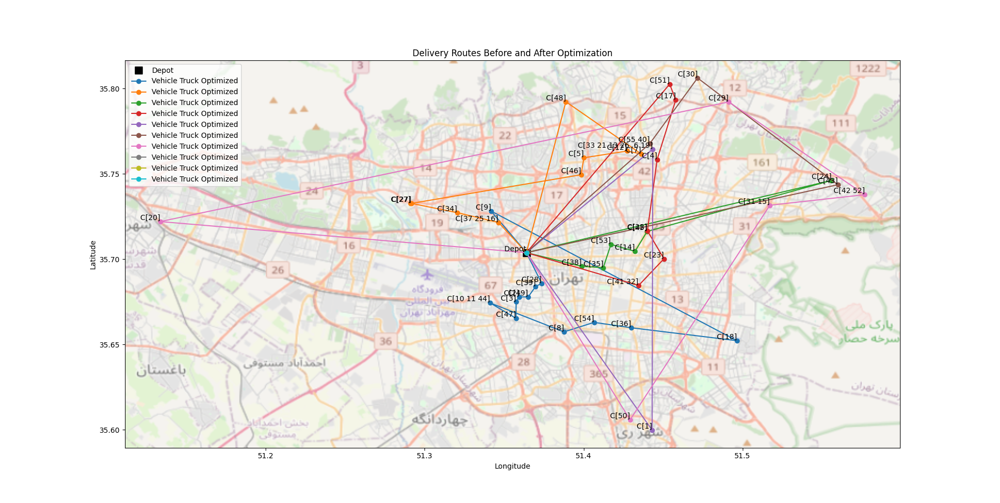

# CVRP Solution for OptimeAI Interview

## Table of Contents
- [Introduction](#introduction)
- [Problem Statement](#problem-statement)
- [Dataset Overview](#dataset-overview)
- [Approach](#approach)
  - [Data Preprocessing](#data-preprocessing)
  - [Clustering Strategy](#clustering-strategy)
  - [Optimization Methods](#optimization-methods)
- [Implementation](#implementation)
  - [Google OR-Tools Optimization](#google-or-tools-optimization)
  - [Heuristic Nearest Neighbor Approach](#heuristic-nearest-neighbor-approach)
- [Performance Evaluation](#performance-evaluation)
- [Vehicle Routing Optimization Results](#vehicle-routing-optimization-results)
- [Challenges and Improvements](#challenges-and-improvements)
- [How to Run the Code](#how-to-run-the-code)

## Introduction
This project tackles the Capacitated Vehicle Routing Problem (CVRP) for a logistics company. The objective is to optimize vehicle routes, minimizing the total distance traveled while meeting all customer demands within vehicle capacity constraints.

## Problem Statement
Given a set of vehicles with defined capacities and a list of customers with known demands and geographic locations, the goal is to efficiently allocate orders to vehicles while minimizing the travel distance and adhering to capacity limits.

## Dataset Overview
Two datasets were provided:
- **Vehicle Info Dataset**: Contains vehicle type, capacity, and the number of available vehicles.
- **Customer Info Dataset**: Includes customer locations (latitude, longitude), demand, and order IDs.

## Approach
### Data Preprocessing
- Data preprocessing was not performed as the dataset contained only one vehicle.
- After visualizing the data, it was found that all locations were in Tehran and that the first row corresponded to the depot.

### Clustering Strategy
- Grouped customer locations based on geographic proximity to simplify the problem and improve efficiency.

### Optimization Methods
Implemented two distinct approaches:
1. **Google OR-Tools** for solving the CVRP optimally.
2. **A heuristic nearest-neighbor method** for an approximate solution.

## Implementation
### Google OR-Tools Optimization

- **Approach**: Uses Google OR-Tools to solve the Vehicle Routing Problem (VRP) with capacity constraints.  
- **Distance Calculation**: Computes a Euclidean distance matrix (great-circle distance via OSMnx) for routing.  
- **Optimization Process**:  
  - Defines a routing model using OR-Tools.  
  - Assigns customers to vehicles using the *Path Cheapest Arc* heuristic.  
  - Applies *Guided Local Search* for further optimization.  
- **Results & Visualization**:  
  - Outputs optimized vehicle routes and total travel distance.  
  - Displays the solution with Matplotlib and OpenStreetMap.  
- **Scalability Considerations**: Efficient for larger datasets but may require traffic-aware distance matrices for real-world deployment.  


### Heuristic Nearest Neighbor Approach

- **Approach**: Assigns customers to vehicles based on proximity while respecting capacity constraints. Each vehicle follows a nearest-neighbor strategy until all customers are served.  
- **Distance Calculation**: Uses great-circle distance (haversine formula via OSMnx) to estimate travel distances.  
- **Optimization Process**: Iteratively assigns the nearest available customer to a vehicle, then returns to the depot.  
- **Results & Visualization**: Prints total travel distance and vehicle routes, with Matplotlib visualizations over OpenStreetMap.  
- **Scalability Considerations**: Efficient for small datasets but may require routing engines and traffic-aware adjustments for larger-scale implementations.  

## Performance Evaluation
Metrics used for evaluation:
- **Total Distance Traveled**: Measures route efficiency.
- **Number of Vehicles Used**: Ensures optimized fleet utilization.

## **Vehicle Routing Optimization Results**  

### **1. OR-Tools Solution**  
#### **Optimized Routes Visualization**  
  

#### **Routing Output**  
```
Route for vehicle 0:
 0 Load(0.0) ->  39 Load(7.916) ->  44 Load(11.339) ->  32 Load(11.752) ->  31 Load(12.973) ->  0 Load(12.973)
Distance of the route: 43870m
Load of the route: 12.973

Route for vehicle 1:
 0 Load(0.0) ->  0 Load(0.0)
Distance of the route: 0m
Load of the route: 0.0

Route for vehicle 2:
 0 Load(0.0) ->  36 Load(0.458) ->  38 Load(12.46) ->  0 Load(12.46)
Distance of the route: 19746m
Load of the route: 12.46

Route for vehicle 3:
 0 Load(0.0) ->  6 Load(0.64) ->  13 Load(6.085) ->  17 Load(7.348) ->  22 Load(9.722) ->  21 Load(11.423) ->  20 Load(12.285) ->  0 Load(12.285)
Distance of the route: 20852m
Load of the route: 12.285

Route for vehicle 4:
 0 Load(0.0) ->  8 Load(1.12) ->  24 Load(3.208) ->  28 Load(3.612) ->  29 Load(4.95) ->  25 Load(8.61) ->  26 Load(8.637) ->  41 Load(9.062) ->  37 Load(11.298) ->  35 Load(11.938) ->  33 Load(12.343) ->  0 Load(12.343)
Distance of the route: 64837m
Load of the route: 12.343

Route for vehicle 5:
 0 Load(0.0) ->  16 Load(2.116) ->  15 Load(6.665) ->  19 Load(9.517) ->  23 Load(12.646) ->  0 Load(12.646)
Distance of the route: 17107m
Load of the route: 12.646

Route for vehicle 6:
 0 Load(0.0) ->  34 Load(1.098) ->  42 Load(2.309) ->  43 Load(3.53) ->  40 Load(6.571) ->  30 Load(9.589) ->  27 Load(12.91) ->  0 Load(12.91)
Distance of the route: 47662m
Load of the route: 12.91

Route for vehicle 7:
 0 Load(0.0) ->  0 Load(0.0)
Distance of the route: 0m
Load of the route: 0.0

Route for vehicle 8:
 0 Load(0.0) ->  0 Load(0.0)
Distance of the route: 0m
Load of the route: 0.0

Route for vehicle 9:
 0 Load(0.0) ->  18 Load(0.0) ->  5 Load(2.559) ->  3 Load(2.98) ->  1 Load(3.842) ->  2 Load(5.105) ->  4 Load(5.563) ->  7 Load(6.636) ->  9 Load(8.106) ->  11 Load(8.79) ->  10 Load(10.028) ->  12 Load(11.239) ->  14 Load(12.986) ->  0 Load(12.986)
Distance of the route: 37818m
Load of the route: 12.986

Total distance of all routes: 251892m
Total load of all routes: 88.603
```

---

### **2. Alternative Algorithm Solution (e.g., Heuristic or Baseline Method)**  
#### **Optimized Routes Visualization**  
  

#### **Routing Output**  
```
Vehicle 1 (Type Truck):
Round Trip Distance: 41479.497 m, Demand: 12.647300000000001
Depot -> C[28] (2179.577 km) -> C[39] (404.374 km) -> C[49] (796.379 km) -> C[2] (519.386 km) -> C[3] (372.512 km) -> C[47] (1065.287 km) -> C[10 11 44] (1790.307 km) -> C[8] (4616.888 km) -> C[54] (1822.699 km) -> C[36] (2135.943 km) -> C[18] (6068.663 km) -> C[9] (16329.661 km) -> Depot (3377.820 km)
Vehicle 2 (Type Truck):
Round Trip Distance: 37505.812 m, Demand: 12.695279999999999
Depot -> C[37 25 16] (2532.867 km) -> C[34] (2424.175 km) -> C[27] (2683.631 km) -> C[27] (35.730 km) -> C[46] (9858.858 km) -> C[5] (1119.482 km) -> C[12] (2485.364 km) -> C[7] (817.711 km) -> C[48] (5456.218 km) -> Depot (10091.776 km)
Vehicle 3 (Type Truck):
Round Trip Distance: 37919.766 m, Demand: 12.492140000000001
Depot -> C[38] (3266.955 km) -> C[35] (1225.996 km) -> C[53] (1583.841 km) -> C[14] (1439.989 km) -> C[45] (1466.921 km) -> C[24] (10982.587 km) -> Depot (17953.477 km)
Vehicle 4 (Type Truck):
Round Trip Distance: 34501.075 m, Demand: 12.61236
Depot -> C[41 32] (6725.837 km) -> C[23] (2259.532 km) -> C[22] (2052.978 km) -> C[4] (4681.766 km) -> C[17] (4017.397 km) -> C[51] (1091.254 km) -> Depot (13672.311 km)
Vehicle 5 (Type Truck):
Round Trip Distance: 41762.339 m, Demand: 12.864090000000001
Depot -> C[33 21 13 26  6 19] (9853.433 km) -> C[1] (18312.900 km) -> Depot (13596.007 km)
Vehicle 6 (Type Truck):
Round Trip Distance: 43871.325 m, Demand: 12.55971
Depot -> C[55 40] (9987.070 km) -> C[30] (5061.949 km) -> C[43] (10578.572 km) -> Depot (18243.734 km)
Vehicle 7 (Type Truck):
Round Trip Distance: 97831.287 m, Demand: 12.730100000000002
Depot -> C[50] (12389.390 km) -> C[31 15] (16085.612 km) -> C[42 52] (5432.913 km) -> C[29] (9810.859 km) -> C[20] (33209.714 km) -> Depot (20902.798 km)

Total distance of all routes:  334871.10 m
Total load of all routes: 88.603
```

---

### **Comparison & Insights**  
| Metric                  | OR-Tools Solution | Alternative Algorithm |
|-------------------------|------------------|-----------------------|
| Total Distance (m)      | **251,892 m**    | 334,871 m             |
| Total Load              | 88.603           | 88.603                |
| Number of Vehicles Used | 7                | 7                     |
| Execution Time          | **Fast**         | Slow                  |

- **Key Observations:**  
  - OR-Tools provides a more optimized solution with better load balancing.  
  - Alternative method is more intutive but results in higher total travel distance.  
  - Improvements could involve traffic-aware routing or real-time adjustments.  


## Challenges and Improvements
### Challenges
- The CVRP is an NP-hard problem, meaning there is no single best solution.
- This was not a typical data science problem, so I conducted R&D, read existing codes, and adapted them to fit the task.

### Potential Improvements
- Compute distances between customers using a routing engine rather than simple Euclidean distance.
- Consider the effect of dynamic traffic flow for better performance in a city like Tehran.
- Provide GIFs for better understanding of the routing process.
- Identify computational bottlenecks and explore scaling strategies for handling larger datasets.

## How to Run the Code
1. Install dependencies:
   ```sh
   pip install -r requirements.txt
   ```
2. Run the or method script:
   ```sh
   python google_or_based.py
   ```
3. Run the alternative script:
   ```sh
   python nearest_neighbor.py
   ```